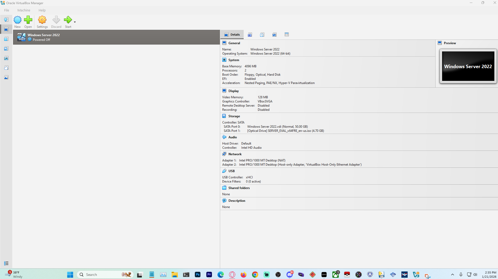
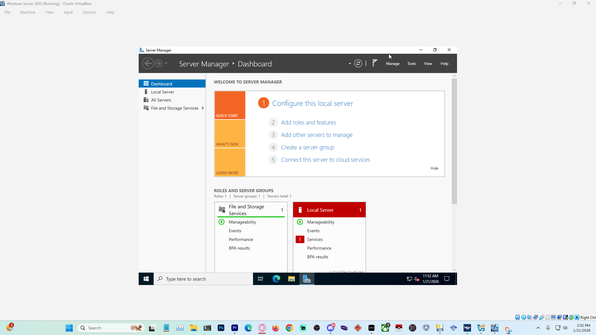
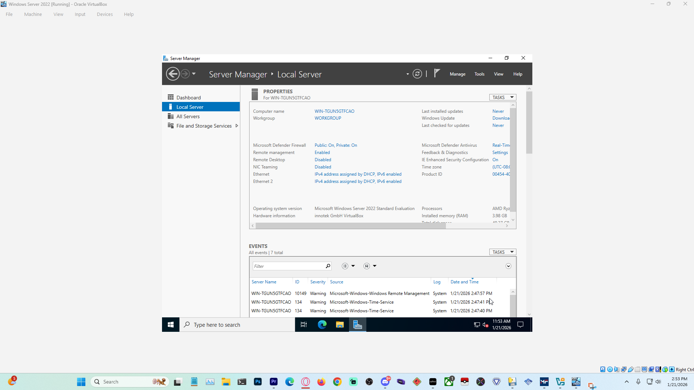
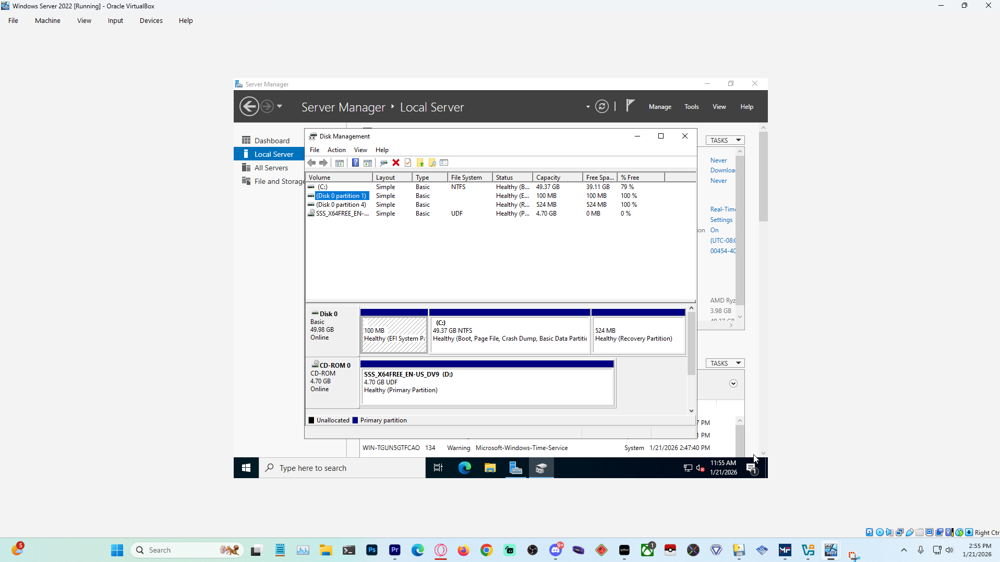
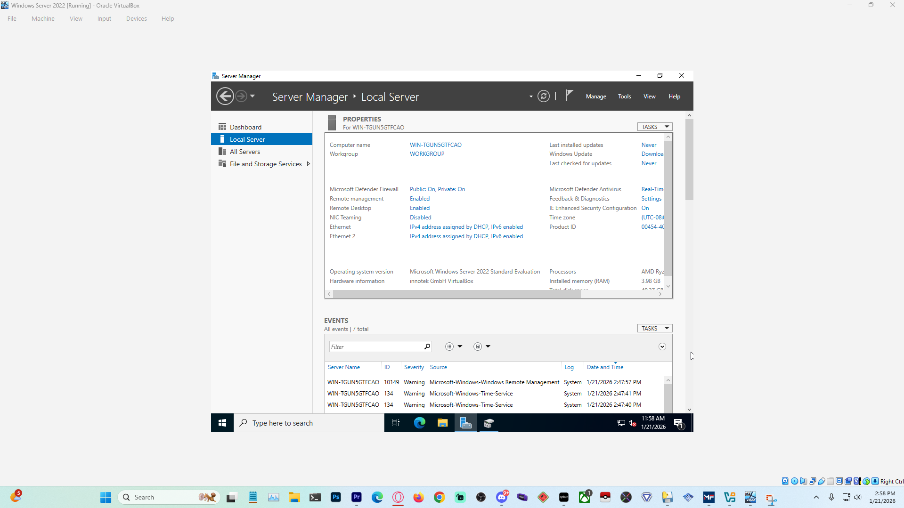
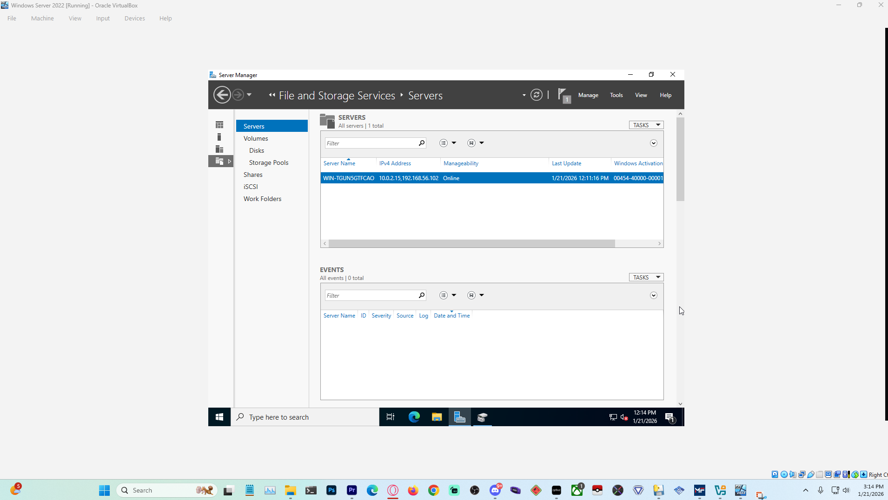

# Windows Server 2022 Virtual Lab (VirtualBox)

## Overview
This project documents the deployment and configuration of a Windows Server 2022 virtual lab using Oracle VirtualBox. The lab was built to demonstrate hands-on experience with virtualization, Windows Server installation, role-based configuration, and service validation in a controlled environment.

## Environment
- Host OS: Windows 10/11
- Hypervisor: Oracle VirtualBox
- Guest OS: Windows Server 2022 (Desktop Experience)
- CPU: 2 vCPUs
- RAM: 4 GB
- Storage: SATA (VDI)
- Networking: NAT + Host-Only Adapter

---

## Virtual Machine Configuration

This screenshot shows the VirtualBox configuration for the Windows Server 2022 virtual machine, including resource allocation, EFI-enabled boot mode, SATA storage controller configuration, mounted installation ISO, and dual network adapters used for internet access and internal lab networking.

---

## Server Installation & Initial Setup

After installation, Server Manager was used to verify that the server was operational and manageable. The dashboard confirms successful deployment and provides access to system health, role management, and configuration tools.

The Local Server view was reviewed to confirm core settings such as network profile, firewall status, and remote management configuration.

Disk Management was used to confirm that the virtual disk was detected, properly partitioned, and formatted with NTFS.

---

## Remote Management Configuration

Remote Desktop was enabled to allow secure remote administration of the server. Network Level Authentication (NLA) was kept enabled in accordance with security best practices.

---

## Role Installation & Validation

The File Server role was installed and validated through Server Manager. This view confirms that the server is manageable, the role initialized successfully, and no post-installation errors or warning events were reported.

---

## Next Steps
Planned enhancements for this lab include:
- Creating and documenting SMB file shares
- Installing and configuring Active Directory Domain Services
- Adding DNS and DHCP roles
- Joining a Windows client machine to the domain
- Implementing Group Policy Objects (GPOs)
